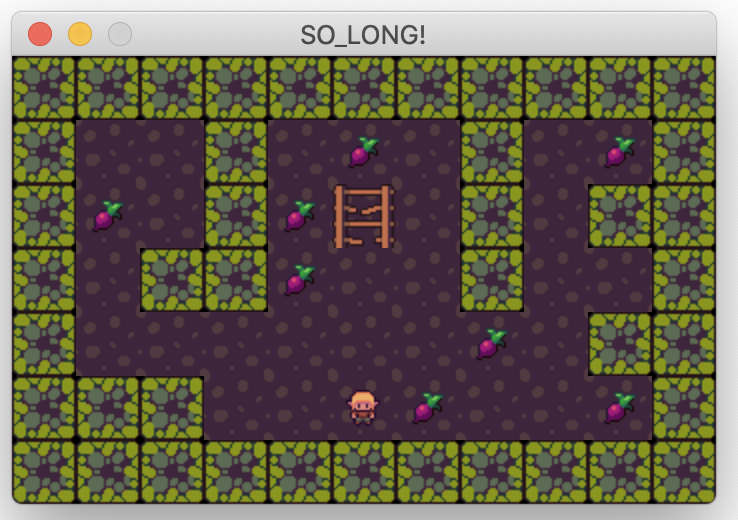

# so_long
This project is a very small 2D game. It is built to make you work with textures, sprites. And some very basic gameplay elements.



## Installation
### Cloning the repositories
```shell
git clone https://github.com/cristinarlr/so_long
cd so_long
make
```

### Compiling the Program
The so_long program comes with a Makefile that includes the following rules:

- `all`: compiles the program
- `re`: recompiles the program
- `bonus`: compiles with animations and enemies
- `fclean`: removes all object files and the program
- `clean`: removes all object files

## Game
### Game Rules
The game we choose must follow a set of rules. The executable ``so_long`` will receive a map as the only argument, and this map will have a ``.ber`` filetype.

The file also must follow these rules:
- Only ``P`` *(player)*, ``1`` *(wall)*, ``0`` *(empty)*, ``C`` *(collectible)*, and ``E`` *(exit)* will be accepted characters in our map (except if you add enemies as bonus)
- The map must be rectangular, i.e. all rows must have the same length
- There must be at least one exit, one player, and one collectible on the map
- The map must be closed, i.e. surrounded by walls
- All collectibles and the exit must be accessible, i.e. they should not be surrounded by a wall

If any of these checks fail, the game must end with ``Error\n`` followed by a custom message.

The goal is for the player(s) to collect all the collectibles on the map before going to an exit in the least possible number of steps

### Playing the Game
To play the so_long game, run the following command:

```bash
./so_long [map_path]
```
`maps/map.ber` is an exemple of a path if you want to play.
You can "cook" your game map file but must be a valid `.ber` file containing the game map.

The player can move around the game map using the arrow keys or WASD. The game ends when the player reaches the exit point after collecting all the collectible objects.

## Acknowdledgement:
This project uses the *Codam's MLX* library and sprites from itch.io
- Codam MLX: [link](https://github.com/codam-coding-college/MLX42)
- Cat: [link](https://itch.io/profile/elthen)
